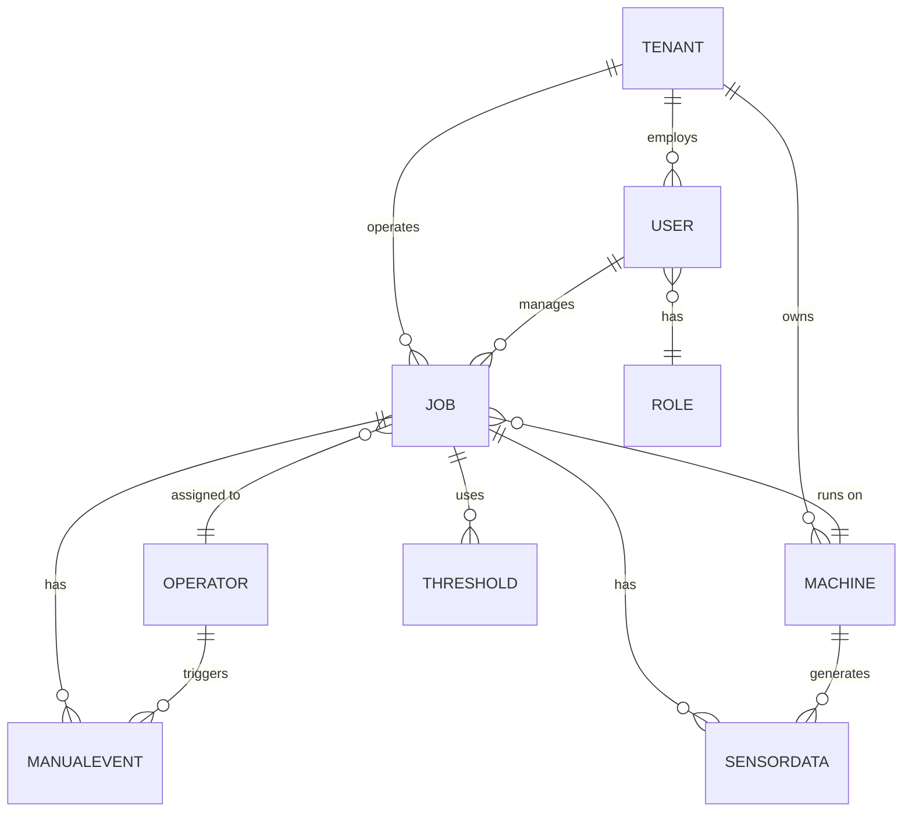

# OEE Monitoring Platform Data Model (Azure, Multi-Tenant)

## 1. Entity-Relationship Diagram (Mermaid)

## 2. Key Tables (PostgreSQL & Azure SQL)

### tenants
| tenant_id (PK) | name | metadata |

### users
| user_id (PK) | tenant_id (FK) | role_id (FK) | name | email | created_at |

### roles
| role_id (PK) | tenant_id (FK) | name |

### machines
| machine_id (PK) | tenant_id (FK) | name | type | config |

### jobs
| job_id (PK) | tenant_id (FK) | machine_id (FK) | operator_id (FK) | supervisor_id (FK) | status | start_time | end_time | metadata |

### manual_events
| manual_event_id (PK) | tenant_id (FK) | job_id (FK) | operator_id (FK) | event_type | start_time | end_time | notes |

### thresholds
| threshold_id (PK) | tenant_id (FK) | job_id (FK) | sensor_type | min_value | max_value | created_by (FK) | created_at |

### sensor_data (Azure SQL)
| id (PK) | tenant_id | job_id | machine_id | sensor_type | value | timestamp |

## 3. Multi-Tenancy & Access Control
- All tables include `tenant_id` for data isolation.
- Users, machines, jobs, events, and thresholds are always queried/scoped by `tenant_id`.
- Roles and access control managed per tenant.

## 4. Data Integration & Analytics
- Sensor data (Azure SQL) and manual events/thresholds (PostgreSQL) are joined by Azure Functions for analytics and anomaly detection.
- All analytics and reporting are tenant-scoped.

---

*For a visual ERD, paste the Mermaid code above into any Mermaid-compatible editor (e.g., mermaid.live).*
